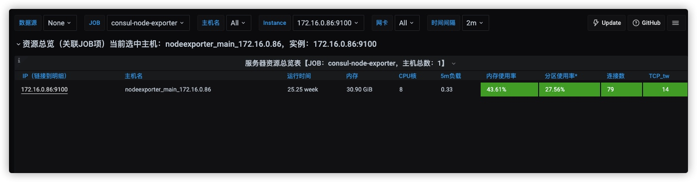

# 项目实施文档

## pull方式部署


该部署方式是把一个拥有公网IP的云服务器作为数据收集和监控总站，各个机器的数据以代理的方式，通过`federate`的进行集中，同时每个机器的中的数据会集中到当地机器的master，由master 统一转发处理


### 公网主机配置

#### 云主机组件部署

下载最新代码
```
git clone https://github.com/bingryan/super-miner.git && cd super-miner
```

直接以`docker-compose` 的方式直接启动部署

```
sudo docker-compose up -d
```

之后启动云服务器的监控


```
bash bin/starter.sh
```

然后通过[nginx 已经代理的域名： miner.your.domain](./nginx.md)进行访问页面，你会发现该服务器的监控信息已经处于监控



#### 云主机代理server配置

之后在机器进行[frp](./frp)代理的server的启动

```
docker run --restart=always --network host -d -v /etc/frp/frps.ini:/etc/frp/frps.ini --name frps snowdreamtech/frps
```


### 机房机器

`配置federate`


```
sudo docker-compose -f docker-compose.federate.yml up -d
```


`配置代理`

```
docker run --restart=always --network host -d -v /etc/frp/frpc.ini:/etc/frp/frpc.ini --name frpc snowdreamtech/frpc
```


每台机器要执行`bin/starter.sh`下的逻辑。采用ansible 进行批量处理


